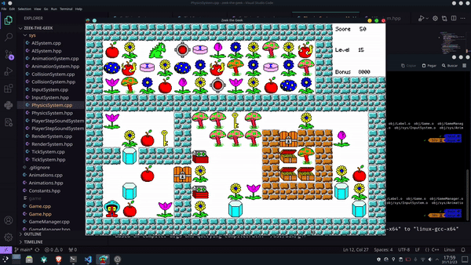

# Attempt to make a clone of the first game i have  played

## Current progress

- C++20
- SFML
- Entity Component System

## Learning resources
- https://www.youtube.com/@ProfesorRetroman
- https://archive.org/details/TFGLaureanoECS20

## Future ideas
- Making an AI agent to play this